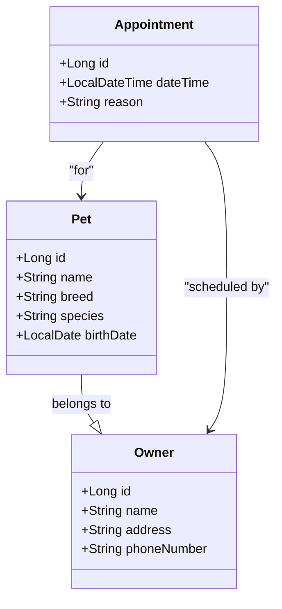

## Diagrama de Classe

## Exemplos de Cardinalidades

| Notação | Descrição                        | Exemplo de Uso               |
|---------|----------------------------------|------------------------------|
| `1`     | Exatamente uma instância         | `Owner "1" --> "1" Pet`      |
| `0..1`  | Zero ou uma instância            | `Owner "1" --> "0..1" Pet`   |
| `1..*`  | Uma ou mais instâncias           | `Owner "1" --> "1..*" Pet`   |
| `0..*`  | Zero ou mais instâncias          | `Owner "1" --> "0..*" Pet`   |
| `*`     | Zero ou mais instâncias (abreviação de `0..*`) | `Owner "*" --> "*" Pet` |

### Exemplos de Aplicação:
- **Um para Um (1:1)**: Um `Owner` possui exatamente um `Pet`.
- **Um para Zero ou Um (1:0..1)**: Um `Owner` pode ter zero ou um `Pet`.
- **Um para Muitos (1:N)**: Um `Owner` possui muitos `Pets`.
- **Muitos para Muitos (N:M)**: Muitos `Owners` podem ter muitos `Pets`.

